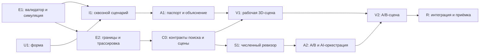

# «Аким — два будущих города»: технический план реализации

> **Для агентов-исполнителей:** выполнять задачи по одной через
> `superpowers:executing-plans` или `superpowers:subagent-driven-development`.
> Владельцы файлов и правила синхронизации из AGENTS.md обязательны.

**Цель:** пользователь принимает пять допустимых решений, получает официальный Score,
понимает последствия и сравнивает свой план с проверенной альтернативой в таблицах и 3D.

**Архитектура:** чистый Python-engine валидирует и рассчитывает результат; численный
поиск проверяет кандидатов; AI предлагает/объясняет, но не считает. Streamlit хранит
снимки A/B, показывает паспорт и передаёт готовые данные компоненту Three.js.

**Стек:** существующие Python 3.11+, Streamlit 1.64.0, OpenAI SDK, unittest/AppTest.
Для 3D — Streamlit Components v2, Three.js и Vite; Node нужен только разработчику.

**Спецификация:** [PROPOSAL.md](PROPOSAL.md), [IDEA.md](IDEA.md).
Источники правил: [TASK.md](TASK.md), [DATASET.md](DATASET.md).
Действующий контракт: [API.md](API.md). Краткий трекер: [PLAN.md](PLAN.md).

План актуализирован по `d454f61` с учётом явного требования пользователя о веб-приложении с рабочей 3D-сценой. Проверка P0 зафиксирована в REVIEW.md. Незавершённые этапы ниже не считаются реализованными.

## Оценка идеи и принятый объём

Идея согласуется с задачей: форма решает распределение бюджета, паспорт объясняет
последствия, 3D визуализирует готовые данные, ревизор проверяет альтернативы.
Все эти части используют один официальный результат, а не конкурирующие модели.

Реализация проходит зависимые этапы: **MVP → рабочая 3D-сцена → A/B-сравнение с ревизором**. Каждый этап сохраняет предыдущий сценарий. Работающая 3D-сцена входит в обязательную продуктовую приёмку; текстовые таблицы и fallback сохраняют доступность при техническом сбое, но не заменяют успешный рендеринг в поддерживаемом браузере. Полный перебор, экспорт и свободный текст поручений остаются необязательными расширениями.

## Общие ограничения

- «Бюджет 100; ровно пять уникальных мер из каталога 14 мероприятий».
- «Максимум две меры из направления; обязательного покрытия всех пяти направлений нет».
- «Для районной меры выбирается район, для городской — `district_id=None`».
- «Горизонт H=8 кварталов; реализованный эффект масштабируется `(8-L)/8`».
- «Невалидный набор не получает Score и не отправляется в AI для анализа результата».
- «Порядок решений не влияет на результат. Остаток денег не даёт бонуса».
- Формула, исходные числа, лаги, синергии, конфликты и clip — только из DATASET.
- TASK.md, DATASET.md и citysim/data.py не редактировать; для граничных тестов создавать копии в памяти.
- `DEMO_MODE=1` исключает внешние API. После установки пакетов демо работает без сети.
- Сборка JS и ассеты лежат в репозитории; проверяющий запускает только `python run.py`.
- Этапы выполняются по зависимостям и критериям приёмки; устаревшие часовые окна не служат основанием исключать обязательные продуктовые функции.
- Коммит/push после каждого принятого пакета согласно правилам репозитория.

## Владельцы и файлы

| Владелец | Меняет | Отвечает за результат |
|---|---|---|
| @alikhan | citysim/engine.py; tests/test_engine.py | Правила, формулы, трассировка, граничные тесты |
| @alikhan | Новые citysim/search.py, citysim/review_models.py, tests/test_search.py; docs/API.md; при необходимости models.py | Проверка кандидатов, детерминированный поиск, общие контракты |
| @alikhan | run.py, requirements.txt, .gitignore, scripts/dependency_report.py, docs/DEPENDENCIES.json | Установка, зависимости и финальная техническая приёмка |
| @AaaDddmyrza | app.py; новые ui/__init__.py, ui/forms.py, ui/results.py, ui/state.py; tests/test_app.py, tests/test_state.py | Форма, снимки, паспорт, интеграция |
| @AaaDddmyrza | citysim/ai.py; новый citysim/reviewer.py; tests/test_ai.py, tests/test_reviewer.py | Объяснения, генерация предложений, offline/live-оркестрация |
| @AaaDddmyrza | scripts/start_live.py, tests/test_live_launcher.py, docs/SECRETS.md | Подготовка существующего API-ключа без сохранения в синхронизируемую папку |
| @AaaDddmyrza | Новый ui/scene.py, tests/test_scene_payload.py; components/city3d/** | 3D-компонент, обмен событиями, отображение A/B |
| @AaaDddmyrza | README, IDEA, PLAN, IMPLEMENTATION_PLAN, THIRD_PARTY, DEMO | Сводные документы, описание демо, комплект сдачи |
| Каждый | Только свой docs/state/<ник>.md; дополнения HANDOFF после pull | Состояние и запросы напарнику |

`data.py` закреплён за @alikhan, но изменения датасета в этом плане запрещены.
Запрос на .gitignore/зависимости от 3D передаётся @alikhan; npm-файлы компонента
ведёт @AaaDddmyrza. Общие README/THIRD_PARTY правит координатор @AaaDddmyrza по
фактам от напарника. API меняет только @alikhan коммитом с префиксом `API:`.

## Зависимости и этапы



Этап начинают после готовности его зависимостей. E1 и U1 могут идти параллельно; после I1/A1 3D-компонент связывается с результатами engine. V1 обязателен: проверить протокол Python↔JS, локальную сборку и рендер в поддерживаемом браузере. Если сцена не рендерится, продолжить исправление интеграции; fallback обеспечивает доступ к сценарию во время сбоя, но не закрывает V1. V2 соединяет планы A/B с той же сценой и завершает целевой сценарий.

## Фокус проверки

1. Редактирование черновика после расчёта: старые A/B не подменяются — тест I1.
2. Два раунда по одной замене: итог отличается от исходного A максимум одной парой — тест S1.
3. Почти равные неокруглённые баллы: допуск, стоимость и ничья согласованы — тест S1.
4. Пустые/невалидные AI-предложения, таймаут: A сохранён, нет ложного оптимума — тест A2.
5. Нет WebGL/сети либо компонент прислал неизвестный район: таблицы работают,
   недопустимое событие игнорируется — проверки V1/V2.

## E1 — правила и расчёт: @alikhan

**Файлы:** engine.py, tests/test_engine.py. **Вход/выход:** действующие
`validate_scenario(decisions, dataset) -> ValidationResult` и
`simulate(decisions, dataset) -> SimulationResult`, без изменения API v1.

- [ ] Добавить падающие тесты всех 9 кодов ошибок API, включая неизвестный ID,
  стоимость повторных строк, city с районом, 4/6 решений и 3 меры одного направления.
  Для каждой проверки остальные параметры делать валидными, чтобы изолировать причину.
- [ ] Прогнать `.venv/Scripts/python.exe -m unittest discover -s tests -p test_engine.py -v`:
  новые проверки должны падать на заглушках, существующие baseline-тесты оставаться зелёными.
- [ ] Реализовать валидатор: собрать все применимые ошибки, безопасно пропустить
  неизвестные ID при проверке метаданных; отдельно глобальный M1/M3 и локальные пары.
- [ ] Реализовать simulate: validate → новые словари → эффекты с лагом → три
  фиксированные синергии → один clip → compute_score → deltas и канонический результат.
- [ ] Проверить эталон и исключение для невалидного набора:

```python
reference = (Decision('M7', 'nura'), Decision('M8', 'nura'),
             Decision('M10', 'nura'), Decision('M12'), Decision('M5', 'saryarka'))
r = simulate(reference, load_dataset())
self.assertEqual((r.cost, r.remaining_budget, r.after.n_crit), (95, 5, 0))
self.assertAlmostEqual(r.after.score, 56.54307, places=7)
with self.assertRaises(InvalidScenarioError):
    simulate(reference[:4], load_dataset())
```

- [ ] Набор 61 валиден; reverse(reference) даёт тот же результат, вход не мутирует.
  Обновить статус E1 в PLAN/state, выполнить полный check и push: `feat: implement scenario engine`.

## U1 — форма пяти решений: @AaaDddmyrza

**Файлы:** app.py, ui/forms.py, ui/__init__.py, tests/test_app.py.
**Интерфейс:** `render_decisions(dataset: Dataset) -> tuple[Decision, ...]`;
пять слотов, ID мер/районов из load_dataset, городская мера всегда с None.

- [ ] Сделать пять строк выбора с устойчивыми ключами `measure_0`…`measure_4`,
  `district_0`…`district_4`. Убирать уже занятые меры из остальных списков,
  но не заменять этим серверную валидацию. Доступны все пять направлений.
- [ ] Стоимость и ошибки брать из validate_scenario. До E1 в UI отключить отправку
  с подписью «Расчёт ещё не подключён»; мок использовать в тестах, не выдавать за расчёт.
- [ ] AppTest: смена районной меры на городскую убирает район; отправляется None.
  На ValidationResult с budget_exceeded выводится сообщение, simulate/AI не вызываются.

```python
invalid = ValidationResult(101, (ValidationIssue('budget_exceeded', 'Бюджет превышен'),))
with patch('citysim.engine.validate_scenario', return_value=invalid), \
     patch('citysim.engine.simulate') as simulate_mock, \
     patch('citysim.ai.explain_result') as ai_mock:
    app = AppTest.from_file('app.py').run()
    app.button(key='calculate').click().run()
    self.assertTrue(app.error)
    simulate_mock.assert_not_called()
    ai_mock.assert_not_called()
```

- [ ] Не требовать одну меру каждого направления. Успешная форма выдаёт ровно
  пять Decision; показать стоимость/остаток только после ответа валидатора.
- [ ] Коммит/push: `feat: add five-decision form`; U1 закрыть после этих проверок.

## I1 — соединение и снимки: @AaaDddmyrza, численная приёмка @alikhan

**Файлы:** app.py, ui/state.py, tests/test_state.py, tests/test_app.py.
**Тип внутри UI:** ScenarioState(draft: tuple[Decision,...],
plan_a: SimulationResult | None, plan_b: SimulationResult | None).
**Функции:** `save_a(state, result) -> ScenarioState`,
`set_draft(state, decisions) -> ScenarioState`; создают копии, не меняют аргументы.

- [ ] При «Рассчитать» вызвать validate/simulate; InvalidScenarioError показать
  через .validation, не вызывать AI. NotImplementedError до E1 — только сообщение о недоступности.
- [ ] При успешном новом A сохранить deepcopy результата и очистить B/ревизию;
  редактирование draft не меняет сохранённые планы. Подписать их наборы решений.
- [ ] Проверить на эталоне, используя реальные engine и AppTest:

```python
state = save_a(ScenarioState((), None, None), simulate(reference, dataset))
edited = set_draft(state, (Decision('M1', 'esil'),))
self.assertEqual(edited.plan_a, state.plan_a)
self.assertEqual(len(edited.plan_a.decisions), 5)
self.assertIsNone(edited.plan_b)
```

- [ ] Полный путь: заполнение эталона → 95/5/56.5431/0 → demo-объяснение;
  затем невалидный черновик → ошибка без нового результата, старый A явно подписан.
- [ ] @alikhan сверяет числа; README получает реальный сценарий. Полный check,
  коммит/push `feat: connect scenario calculation and saved state`.

## E2 — границы математики: @alikhan

**Файлы:** tests/test_engine.py, engine.py только при обнаруженных дефектах.

- [ ] В таблицу тестов включить бюджет ровно 100 и 101; <40 и =40; все три
  синергии без масштабирования лагом; все конфликты, в том числе M1/M3 в разных районах.
  Примеры стоимости: M3/Есиль + M7/Нура + M8/Нура + M14/город + M11/Алматы = 100;
  M3/Есиль + M5/Сарыарка + M2/город + M12/город + M11/Алматы = 101.
- [ ] Синтетическими копиями входа проверить clip у 0/100 и сложение до clip.
  Отдельно M11 даёт T1=-1.75 до clip, а не положительный эффект.
- [ ] Для каждого результата проверить `after-before == indicator_deltas`;
  `effects` может отличаться от delta при clip и содержит источник M10+M12 отдельно.
- [ ] Проверить независимость before/after/входа и порядок решений; выполнить
  полный check. Коммит/push `test: cover scenario boundaries and effect traces`.

## A1 — паспорт и объяснение: @AaaDddmyrza

**Файлы:** ui/results.py, app.py, citysim/ai.py, tests/test_ai.py, tests/test_app.py.
**Интерфейсы:** `render_result(result: SimulationResult, dataset: Dataset) -> None`;
существующий explain_result без изменения сигнатуры.

- [ ] Показать cost/remaining_budget/before/after/score_delta; пять районов,
  критические пары и трассировку effects отдельно от фактических deltas.
- [ ] Шаблон demo: сильные стороны, изменения, оставшиеся проблемы, компромисс,
  следующий шаг. Критические пары берутся из indicators; никаких придуманных прогнозов.
- [ ] В тесте с реальным эталоном проверить числа 95, 5, 56.5431, нулевой Ncrit,
  отсутствие утверждения «это baseline» и неизменность SimulationResult.
- [ ] Проверить demo с фиктивным ключом: OpenAI не вызывается; live-ответ,
  пустой ответ и ошибка провайдера — моками. Реальный API только при отдельно
  настроенном доступе; отсутствие такого доступа не блокирует демо.
- [ ] Полный check, README и коммит/push `feat: explain scenario outcomes and tradeoffs`.

## C0 — контракт расширений: @alikhan, потребитель @AaaDddmyrza

**Файлы:** новый citysim/review_models.py, docs/API.md. До этого коммита
описанные ниже типы — проект контракта, а не доступные импорты. API v1 не ломать.

```python
@dataclass(frozen=True)
class ReviewConstraints:
    locked: tuple[Decision, ...] = ()
    max_changes: int = 1

@dataclass(frozen=True)
class CandidateCheck:
    decisions: tuple[Decision, ...]
    errors: tuple[ValidationIssue, ...]
    result: SimulationResult | None

@dataclass(frozen=True)
class ReviewResult:
    source: SimulationResult
    best: SimulationResult
    checks: tuple[CandidateCheck, ...]
    status: Literal['completed_limited', 'incomplete']
    outcome: Literal['improved', 'cheaper_equal', 'unchanged']
    constraints: ReviewConstraints
```

- [ ] Закрепить числовой допуск EPS=1e-9 для сравнения неокруглённых Score.
  Выше на >EPS — улучшение; в пределах EPS и дешевле — cheaper_equal;
  при равенстве Score/стоимости сохраняется A, остальные доступны в checks.
- [ ] «Одно изменение» = замена пары measure_id/district_id; перестановка — ноль.
  Для валидных пятёрок `changes = 5 - len(set(A.decisions) & set(candidate))`.
  Оба раунда сравниваются с первоначальным A; цепочка двух замен лимит не обходит.
- [ ] locked — подмножество пар исходного A; закреплённый район тоже неизменяем.
  Неверные constraints отклонить ValueError до поиска; baseline не принимать как A.
- [ ] Согласовать ScenePayload schema_version=1: states=[{id,label,is_baseline,
  decisions,cost,remaining_budget,score,districts,district_scores}], selected_indicator,
  selected_district,diff_only. districts включают id/name/indicators; баллы из engine.
  События JS: district_selected={district_id}, render_error={code}; камера — локальное состояние JS.
- [ ] Записать эти поля/семантику в API, обновить HANDOFF и выполнить
  `API: feat: define review and scene contracts`. После push потребитель делает pull.

## S1 — детерминированный ревизор: @alikhan

**Файлы:** citysim/search.py, tests/test_search.py.
**Интерфейсы:**

```python
generate_candidates(source: SimulationResult, dataset: Dataset,
                    constraints: ReviewConstraints, *, limit: int = 20
                    ) -> tuple[tuple[Decision, ...], ...]
review_candidates(source: SimulationResult, candidates: Sequence[Sequence[Decision]],
                  dataset: Dataset, constraints: ReviewConstraints, *,
                  completed: bool = True,
                  previous: ReviewResult | None = None) -> ReviewResult
```

- [ ] Начать с тестов: невалидный A, чужая locked-пара, повтор кандидата,
  неизвестные ID, худший кандидат, равенство, EPS, лимит изменений/закрепления.
- [ ] Генератор перебирает замены одной незакреплённой пары из официального каталога:
  городские None, районные все пять районов. Дедупликация канонических наборов.
  Приоритет кандидатов: воздействие на критические показатели слабейшего района,
  затем стоимость, затем ID; не вычислять новый Score вне simulate.
- [ ] Возвращать максимум 20 предложений: это не все возможные варианты.
  Проверяющий на каждый уникальный кандидат применяет constraints, validate,
  затем simulate только для допустимого. Ошибки constraints: locked_changed,
  change_limit; ошибки engine сохраняются. Source всегда участвует в выборе.
- [ ] previous разрешён только с тем же source и constraints; его checks/best
  копируются, уже проверенные наборы не считаются заново. Общий предел — 20
  уникальных кандидатов, включая предыдущий раунд; исходный A в этот лимит не входит.
- [ ] При полном равенстве лучшего с A сохранить A; равнозначные альтернативы
  остаются в checks. Ничего не округлять для сравнения, не менять source.

```python
review = review_candidates(a, [a.decisions[:4]], dataset, ReviewConstraints())
self.assertEqual(review.best, a)
self.assertEqual(review.outcome, 'unchanged')
self.assertIsNone(review.checks[0].result)
self.assertTrue(review.checks[0].errors)
```

- [ ] Отдельный тест двух кандидатов: второй отличается от A двумя парами,
  но от первого одной — он обязан получить change_limit.
- [ ] Замерить ограниченный прогон на рабочем ПК, записать реальное время в state.
  Не заявлять «оптимален». Тесты + полный check; `feat: add bounded scenario reviewer`.

## V1 — один 3D-макет: @AaaDddmyrza

**Файлы:** ui/scene.py, tests/test_scene_payload.py;
components/city3d/__init__.py; frontend/package.json, package-lock.json,
vite.config.js, src/main.js, src/scene.js; build/city3d.js.
**Интерфейсы:** `build_scene_payload(dataset, states, *, selected_indicator='S1',
selected_district=None, diff_only=False) -> dict`; `render_city(payload, key='city') -> dict`.

- [ ] Подтвердить протокол: Python передаёт подписанные районы, JS возвращает `district_selected`. Использовать Components v2 установленного Streamlit:

```python
city = st.components.v2.component(
    'city_view', html='<div class="city-root"></div>',
    js=(ROOT / 'build/city3d.js').read_text(encoding='utf-8'),
)
event = city(data=payload, key='city', on_district_selected_change=lambda: None,
             on_render_error_change=lambda: None)
```

- [ ] Vite library build: один ES-module с default-export функции component;
  Three.js и OrbitControls включить в bundle, не external/CDN. npm install
  --save-exact three; npm install --save-dev --save-exact vite; npm run build.
  Зафиксировать lock и проверенные версии/лицензии в THIRD_PARTY. Node не нужен для запуска Python.
- [ ] Пять устойчиво расположенных районов, простые геометрические объекты;
  подписи, одна шкала 0–100, маркер <40. Символ меры — обозначение проекта,
  а не количество реально построенных зданий. Данные передавать через data,
  подписи через textContent; не встраивать LLM-текст в JavaScript/HTML.
- [ ] Python отклоняет неизвестный district_id. Выбор района фильтрует панель,
  не меняет решения A. Камера не сбрасывается при обновлении payload.
  Освободить renderer/геометрию/listeners при удалении компонента.
- [ ] Тест payload: значения равны SimulationResult, ключа/env нет, JSON сериализуется.
  В браузере: отключить внешнюю сеть, выбрать район, потерять WebGL-контекст —
  сообщение и таблицы сохраняются. AppTest не подтверждает рендеринг WebGL.
- [ ] Не переносить расчёты в JS. Исправить обмен данными и добиться рендеринга сцены в поддерживаемом браузере; таблицы и fallback показывают тот же результат при недоступности WebGL. После приёмки отметить V1 в PLAN.

## A2 — A/B и AI-оркестрация: @AaaDddmyrza

**Файлы:** citysim/reviewer.py, tests/test_reviewer.py, ui/state.py,
ui/results.py, app.py, tests/test_app.py. **Зависимости:** C0, S1, I1/A1.
**Интерфейс:** `review_scenario(source, dataset, constraints, *, demo_mode=True,
api_key=None, model=None) -> tuple[ReviewResult, Explanation]`.

- [ ] Сначала ручное сравнение: посчитать другой валидный набор, сохранить его
  как B, показать бюджет/Score/Ncrit/районы рядом. Кнопка «Оставить A» сохраняет A.
  Кнопка «Принять B» копирует B в A, сбрасывает прежний review; без автоматического применения.
- [ ] Demo берёт до 20 кандидатов из generate_candidates. Live — не более двух
  раундов по 10 наборов, только ID. Каждый раунд строится относительно того же A;
  review_candidates получает только новый batch и previous от первого раунда,
  сохраняет одинаковые ограничения и не повторяет расчёты.
- [ ] До API-вызова проверить валидность source и constraints. Ответ со сломанным
  JSON/неверной структурой не считать кандидатом; неизвестные строковые ID
  передать в валидатор и записать реальную причину отказа. Лимиты проверять кодом.
- [ ] SDK timeout/max_retries — как в explain_result; общий лимит ревизии 35 секунд,
  максимум два запроса с timeout 15 секунд. По истечении status=incomplete,
  сохранён лучший уже проверенный набор. Demo не ждёт сетевых таймаутов.
- [ ] При недоступности AI выполнить ограниченный demo-поиск и явно указать fallback.
  Если он завершён — completed_limited с mode=demo и warning; это не успех live.
  Неудача всей ревизии — incomplete и A сохранён. Журнал только из checks,
  число проверок считается из записей, не генерируется моделью.
- [ ] Тесты моками: demo не создаёт SDK; пустые/невалидные ответы; таймаут во втором
  раунде сохраняет результат первого; источник не мутирует; locked и limit соблюдены.
  Успешный ответ LLM с выдуманным Score игнорирует это число и считает через engine.
- [ ] Кнопки статуса: improved / cheaper_equal / unchanged / incomplete;
  при unchanged текст «В проверенных вариантах улучшений нет». Режим полного поиска
  не показывать. Полный check, `feat: compare plans and integrate AI review`, push.

## V2 — два будущих состояния: @AaaDddmyrza

**Файлы:** ui/scene.py, frontend/src/scene.js, src/main.js, build/city3d.js,
tests/test_scene_payload.py. **Вход:** два снимка A/B после A2.

- [ ] Одна сцена с переключателем A/B обязательна; две панели с общей камерой —
  если успеваем. Baseline отдельный подписанный ориентир. Обе сцены имеют одинаковые
  освещение, масштаб, геометрию общих объектов и легенду.
- [ ] Пять слоёв: каждый раскрывает конкретные два показателя направления;
  не усреднять их в новый рейтинг. Подсветка «Только различия» по данным A/B.
- [ ] Район → показатели → measures/effects в панели; Python фильтрует меры по
  наличию индикатора в effects каталога. Цифры только из сохранённого результата.
- [ ] Браузерная приёмка: A==B выглядит одинаково; переключение сохраняет камеру;
  изменение черновика не меняет сцены; узкий экран переключает A/B без потери данных;
  выключенный WebGL оставляет доступные таблицы и кнопки.
- [ ] Без анимации роста/деградации по кварталам; исключить CDN-запросы после установки. Собрать JS и проверить переключение/различия в браузере; после приёмки отметить V2 в PLAN.

## Q1/R1/R2 — сдача: оба, финальный запуск @AaaDddmyrza

- [ ] @AaaDddmyrza: README описывает только реализованное; docs/DEMO.md содержит
  два действительно рассчитанных набора, демонстрацию отказа невалидного выбора
  и случай «улучшений не найдено» без заявления глобального оптимума.
- [ ] @alikhan: `python run.py --check`, pip check, .env.example, API, зависимости,
  отсутствие секретов, наличие локального JS-bundle; полная численная приёмка.
- [ ] @AaaDddmyrza: чистое окружение, команды README без .env/ключа, demo после установки и проверка доступности 3D-сборки.
- [ ] Проверить эталон, ошибку бюджета, изменение Score другого валидного набора,
  сохранность A/B, fallback AI/3D. При провале владелец исправляет, проверку повторить.
- [ ] Каждый обновляет свой state до 40 строк и статусы PLAN; координатор закрывает HANDOFF по выполненным запросам. Соблюдать правила истории Git и передачи изменений репозитория.

## Необязательные расширения после обязательной приёмки

Полный поиск оптимума — @alikhan после замера производительности и отдельного расширения API. До фильтров 1 407 050 размещений; этот размер не доказывает, что перебор будет практически приемлем по времени. Ключ кэша обязан включать dataset/правила/constraints;
только полное завершение объявленного пространства разрешает слово «оптимален».
UI полного поиска, свободный текст поручений, экспорт HTML/презентации и сложные анимации — @AaaDddmyrza после готового V2. Случайные события исключены из продуктовой модели.

## Проверенная техническая опора

Сигнатура Components v2 проверена в установленном Streamlit 1.64.0.
Подход v2 и двусторонний обмен описаны в [Streamlit Docs](https://docs.streamlit.io/develop/concepts/custom-components/components-v2).
Локальная npm-сборка Three.js описана в [Three.js Installation](https://threejs.org/manual/pages/installation.html).
Версии новых npm-зависимостей фиксируются при V1 в package-lock/THIRD_PARTY;
до V1 они не установлены и не считаются зависимостями работающего P0.
